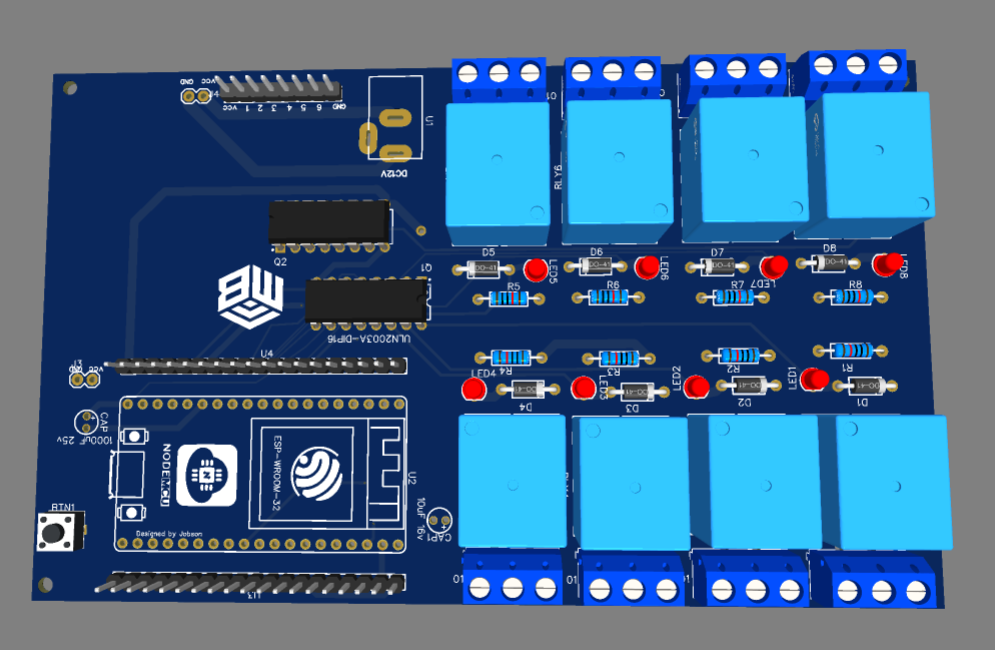
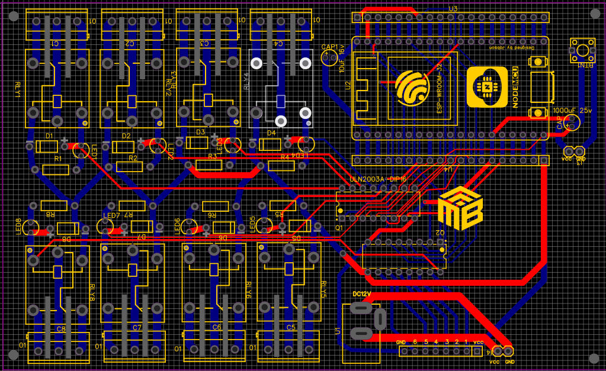

# 🏠 Lumina Smart Home (PCB Relay Controller)

**An end-to-end IoT ecosystem for smart home automation, featuring custom PCB hardware, ESP32 firmware, and an AI-powered control dashboard.**

---

## 📖 Project Overview

This repository contains the complete stack for the **Lumina Smart Home** automation system. The project allows users to control physical devices (like LEDs and relays) remotely via a web/mobile application. It features real-time control, an intelligent connection system, and is designed to work with custom PCB hardware.

### 🔗 Live Application
> **Try the app:** [https://led-on-off-8ef7b.web.app/](https://led-on-off-8ef7b.web.app/)

---

## 🖥️ Dashboard UI

| Dashboard Home | ESP32 Source Code Viewer |
|:---:|:---:|
|  |  |

<em>Lumina Smart Home — AI-powered dashboard with voice assistant, room controls, and built-in ESP32 code viewer</em>

---

## 📂 Repository Structure

The project is organized into three main components:

### 1. `hardware/` (PCB & Circuits)
This directory contains the physical hardware designs for the smart home system.
* Contains the Gerber files (`Gerber_Smart-house_PCB.zip`) ready for PCB manufacturing.
* Designed to integrate the ESP32 microcontroller with relays and power management circuits for safe home automation.

| 3D Board Render | PCB Routing Layout |
|:---:|:---:|
|  |  |

**Key Components:**
- **NodeMCU ESP-WROOM-32** — WiFi-enabled microcontroller
- **2× ULN2003A (DIP16)** — Darlington transistor relay drivers
- **8× Electromechanical Relays** — For switching high-power loads
- **8× Flyback Diodes (D1-D8)** — Voltage spike protection
- **8× Status LEDs (LED1-LED8)** — Visual relay state feedback
- **12V DC Power Input** with filtering capacitors (1000µF + 10µF)

### 2. `esp32_code/` (Microcontroller Firmware)
Contains the C++ firmware (`led_controller.ino`) that runs on the ESP32 microcontroller.
* **Intelligent Connect:** Automatically scans and connects to prioritized home WiFi networks or falls back to the strongest open network.
* **Hardware Interface:** Directly controls the GPIO pins connected to the relays/LEDs based on commands received from the software.
* **Real-time Synchronization:** Listens for state changes and securely updates the hardware states.

### 3. `software/` (Application Dashboard)
The user-facing application built to control the smart home ecosystem.
* **Tech Stack:** Modern web application (React/Vite/TypeScript) with Flutter integration.
* **Features:** A sleek, responsive UI dashboard to toggle devices, monitor statuses, and manage the home network. 
* **AI Powered:** Gemini AI integration for voice commands and smart conversations.
* **Backend:** Powered by Firebase (Hosting, Database) for real-time state synchronization across all connected devices.
* **Multi-platform:** Web, Android, iOS, Windows, macOS, and Linux support via Flutter.

---

## 🚀 Getting Started

### Software (Web Dashboard)
To run the web application locally:
1. Navigate to the `software/` directory.
2. Run `npm install` to install dependencies.
3. Add your Gemini API key in `.env.local`.
4. Run `npm run dev` to start the local development server.

### Firmware (ESP32)
To flash the ESP32:
1. Open `esp32_code/led_controller.ino` in the Arduino IDE.
2. Select your ESP32 board and COM port.
3. Install any required libraries mentioned in the code.
4. Compile and upload to the board.

### Hardware
To fabricate the PCB:
1. Download the Gerber files from `hardware/`.
2. Upload the zip directly to a PCB manufacturer like [JLCPCB](https://jlcpcb.com) or [PCBWay](https://pcbway.com).

---

## 🛠️ Tech Stack

| Layer | Technology |
|-------|-----------|
| **Hardware** | Custom PCB, ESP-WROOM-32, ULN2003A, 8-Channel Relays |
| **Firmware** | Arduino (C++), WiFi, Firebase RTDB |
| **Frontend** | React, TypeScript, Vite, Tailwind CSS, Flutter |
| **AI** | Google Gemini 2.5 Flash |
| **Backend** | Firebase Hosting, Realtime Database |
| **Voice** | Web Speech API, Text-to-Speech |

---

*Built with ❤️ for Home Automation*
